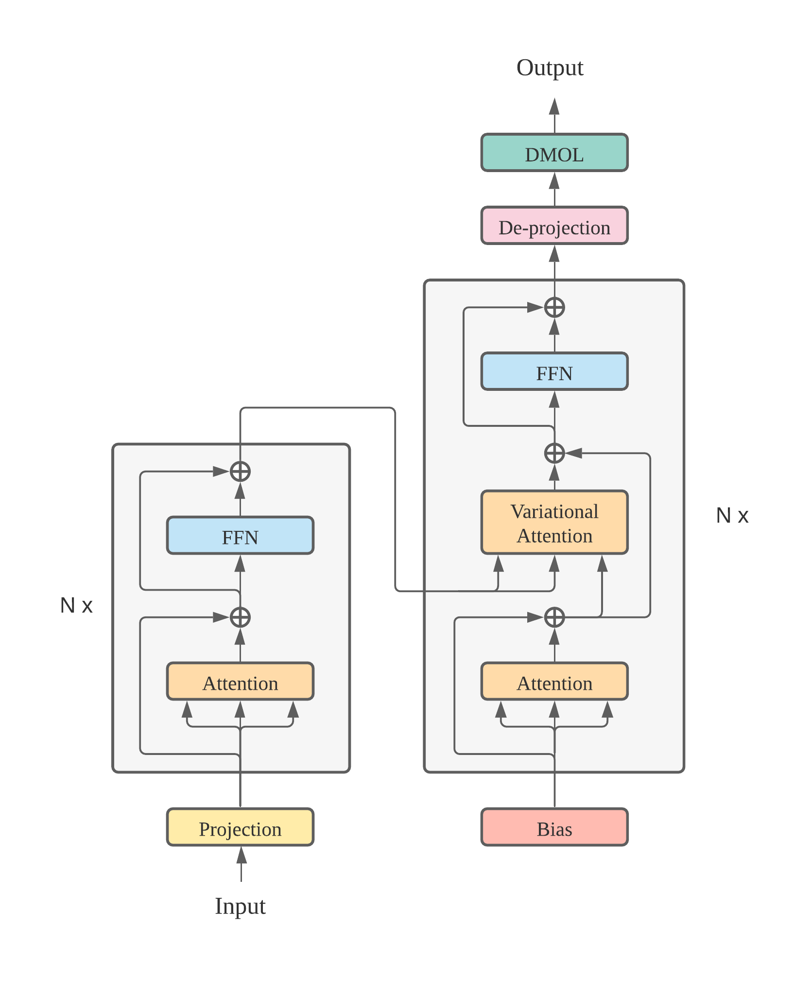
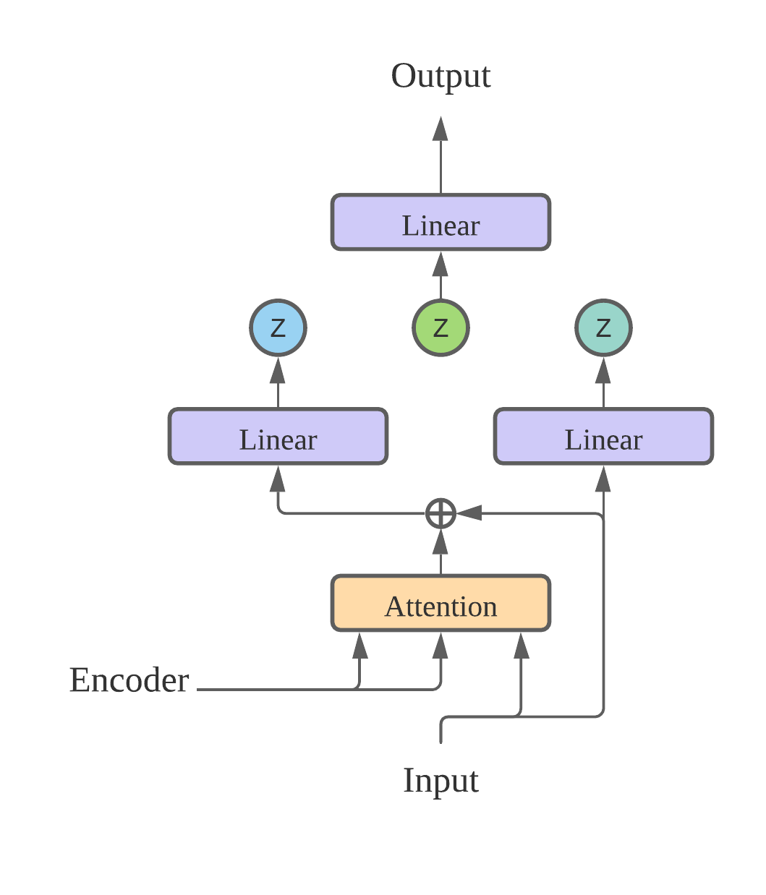

# Metroplex 



More efficient non-autoregressive image modeling inspired by VD-VAE and ViT

- VQ-VAE-based image modeling is currently very popular (e.g. DALL-E). However, it is both computationally inefficient due to the use of discrete bottleneck and extremely slow at sampling due to its autoregressive sampling of discrete latents, the latter of which is especially problematic for audio and video. 

- Continuous VAE (e.g. VD-VAE) resolves the latter point but has further space for improvement w.r.t. the former, such as by incorporating the ideas from the SotA models like ViT, which allow to compress a patch of an image into a single timestep of Transformer.

- Metroplex combines continuous VAE and ViT-style compression together. This allows to project the image into smaller resolution to process it more efficiently and decompresses at the final linear layer. Stable end-to-end training without discrete bottleneck is possible thanks to the use of VD-VAE.

This is a research repo to run experiments to show that Metroplex outperforms VD-VAE and to perform architecture optimization and scaling analysis. It is probably hard for other people to use at the current state. Once the experiments are done, more simplified repositories (TF & PyTorch) will be set up to ease any modification or further extension. For more details about Metroplex, please refer to [this paper](https://www.overleaf.com/read/qjrfdgtghsph) (wip).  

We have borrowed the data pipeline from [DALLE-mtf](https://github.com/EleutherAI/DALLE-mtf), which was developed by [Sid Black](https://github.com/sdtblck), [Ben Wang](https://github.com/kingoflolz) and a few others. 

## Setup

Install the dependencies:
```bash
pip3 install -r requirements.txt
```

Dataset preparation is identical to that of [DALLE-mtf](https://github.com/EleutherAI/DALLE-mtf). Please refer to the link for details.

Runs on TPUs, untested on GPUs but should work *in theory*. 
The example configs are designed to run on a TPU v3-32 pod.

To set up TPUs, sign up for [Google Cloud Platform](https://cloud.google.com/), and create a [storage bucket](https://cloud.google.com/storage). 

Create your VM through a google shell (`https://ssh.cloud.google.com/`) with `ctpu up --vm-only` so that it can connect to your Google bucket and TPUs and setup the repo as above.

## Training

To run the training, adjust the params in a JSON file of your choice in `configs` to a glob path pointing to a dataset of tfrecords, and adjust image size to the appropriate size, e.g.

```
    "dataset":{
      "train_path":"gs://aran-test/imagenet32/train/*.tfrecords",
      "eval_path":"gs://aran-test/imagenet32/valid/*.tfrecords",
      "image_size":32,
      "tfrecords":true
    }
```

I believe the adjusting the params properly is not easy for the user at this moment. Please wait until this issue is resolved. 

Once this is all set up, create your TPU, then run:

```bash
python train.py --tpu your_tpu_name --model json_file_name
```

The training logs image tensors and loss values, to check progress, you can run:

```bash
tensorboard --logdir your_model_dir
```

## TODO

- [x] Test Metroplex
- [x] Add experiments
- [x] Finish `run_experiment.py`
- [x] Add Imagenet-21k for experiments
- [ ] Finish all the experiments
- [ ] Enable decoding (pretty much done, but low-priority as ELBO is a robust indicator of quality as in LM)
- [ ] Build a simple repo streamlined for extension of Metroplex with clear documentation
- [ ] Modify Metroplex for other modalities, such as audio and video
